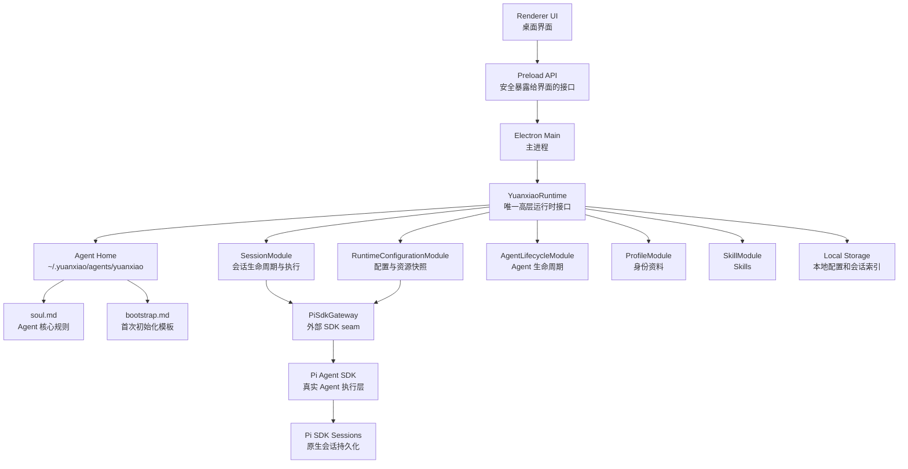

# 元宵 MVP 路线图

> 项目代号：`yuanxiao`
>
> 产品方向：桌面端 Agent 工作台。第一版使用 Pi Agent SDK 跑通真实 Agent 会话；后续逐步加入记忆、技能和自我进化能力。

## 设计判断

我们采用 **pi-gui 的桌面架构 + Pi Agent SDK 的执行能力 + Hermes 的记忆/技能进化思想**。

几个术语先定义清楚：

- **Electron**：一个用 Web 技术开发桌面应用的框架。它通常分成主进程和渲染进程。主进程负责系统能力，比如文件、窗口、进程；渲染进程负责界面。
- **Pi Agent SDK**：第一阶段使用的 Agent 执行层。它负责真正创建 Agent 会话、发送消息、返回事件。
- **Driver**：驱动适配层。上层只调用统一接口，底层可以接 Pi SDK，也可以以后换成我们自己的 Agent Runtime。
- **Agent Runtime**：Agent 的运行时系统，负责模型调用、工具调用、上下文组织、任务循环等能力。
- **Agent Home**：某个 Agent 的本地工作目录。v1 默认 Agent 是 `yuanxiao`，目录是 `~/.yuanxiao/agents/yuanxiao`。
- **soul.md**：Agent 的核心身份和行为规则。v1 由首次 bootstrap 对话生成，后续每次会话注入上下文，并允许 Agent 自动更新。
- **user.md**：Agent 对用户的用户画像。它记录用户称呼、语言偏好、工作类型、决策偏好和边界，由 Agent 在会话中自动维护。
- **bootstrap.md**：首次初始化 Agent 时使用的固定问题模板。bootstrap 完成并生成 `soul.md` 后删除。
- **soul.history / user.history**：`soul.md` 和 `user.md` 的历史备份目录。Agent 自动更新前必须备份旧版本。
- **Memory**：长期记忆。它不是训练模型，而是把用户偏好、项目经验、工作约束保存下来，下次对话时注入上下文。
- **Skill**：可复用能力说明。通常是 `SKILL.md` 加脚本、模板、参考资料，用来教 Agent 如何稳定完成某类任务。
- **MVP**：最小可用产品。目标是用最小功能跑通真实闭环，而不是一开始做完整平台。

Pi Agent SDK 的能力清单、支持顺序和暂不支持项见 `docs/pi-agent-sdk-capability-plan.md`。

## 四步 MVP

### 第一阶段：桌面壳 + Pi SDK 会话闭环

目标：让用户可以启动桌面应用，配置模型/API Key，创建一次真实 Agent 会话，发送消息并收到 Pi Agent SDK 的响应。

这一阶段只实现 `PiSdkDriver`，但目录和接口必须按可替换 Driver 来设计。也就是说，界面不直接依赖 Pi SDK。

### 第二阶段：本地 Memory + Skill 管理

目标：让产品开始沉淀用户偏好、项目经验和可复用工作流。

这一阶段暂不展开自动写入策略。开发前需要继续讨论：

- Memory 应该存在哪里：Markdown、SQLite，还是两者组合。
- Skill 的目录规范和启用规则。
- 用户如何确认、编辑、删除记忆和技能。
- RuntimeSnapshot 如何展示当前启用的模型、技能和设置。

### 第三阶段：后台学习复盘

目标：任务结束后由后台 Worker 复盘对话，提出 Memory 和 Skill 更新建议。

后台复盘必须有权限边界。它可以建议写入记忆或技能，但不能随意修改项目代码。

### 第四阶段：自有 Runtime 或更深度 Agent Core

目标：当 Pi SDK 无法满足深度定制时，实现自己的 `CustomRuntimeDriver`。

这一阶段重点不是重写 UI，而是在 Driver 抽象下替换底层 Agent Runtime。

## 第一阶段详细设计

### 第一阶段目标

第一阶段只验证一个核心闭环：

1. 用户打开 Electron 应用。
2. 应用创建默认 Agent Home：`~/.yuanxiao/agents/yuanxiao`。
3. 用户配置 Provider、API Key 和 Model，并通过真实 SDK 验证。
4. 用户进入首次 bootstrap 对话，回答固定问题。
5. 应用生成并写入 `soul.md` 和 `user.md`。
6. 用户创建普通 Agent 会话。
7. 用户发送消息。
8. 应用通过 Pi Agent SDK 收到真实响应和事件。
9. 会话记录可以通过 Pi SDK session 持久化保存和重新打开。

### 第一阶段非目标

第一阶段不做这些事情：

- 不做自动记忆写入。
- 不做 Skill 自进化。
- 不做插件市场。
- 不做多 Agent 编排。
- 不做自己的 Agent Runtime。
- 不让 Renderer 直接调用 Pi SDK。

**Renderer** 指 Electron 里的界面进程，也就是 React/Vue/Svelte 这类前端代码运行的地方。它不应该直接访问 Node.js 文件系统或 SDK 内部对象。

### 第一阶段架构


```mermaid
flowchart TD
  UI["Renderer UI<br/>桌面界面"] --> Preload["Preload API<br/>安全暴露给界面的接口"]
  Preload --> Main["Electron Main<br/>主进程"]
  Main --> Runtime["YuanxiaoRuntime<br/>唯一高层运行时接口"]
  Runtime --> AgentHome["Agent Home<br/>~/.yuanxiao/agents/yuanxiao"]
  AgentHome --> Soul["soul.md<br/>Agent 核心规则"]
  AgentHome --> Bootstrap["bootstrap.md<br/>首次初始化模板"]
  Runtime --> ConfigModule["RuntimeConfigurationModule<br/>配置与资源快照"]
  Runtime --> SessionModule["SessionModule<br/>会话生命周期与执行"]
  Runtime --> AgentModule["AgentLifecycleModule<br/>Agent 生命周期"]
  Runtime --> ProfileModule["ProfileModule<br/>身份资料"]
  Runtime --> SkillModule["SkillModule<br/>Skills"]
  SessionModule --> PiGateway["PiSdkGateway<br/>外部 SDK seam"]
  ConfigModule --> PiGateway
  PiGateway --> PiSDK["Pi Agent SDK<br/>真实 Agent 执行层"]
  Runtime --> Storage["Local Storage<br/>本地配置和会话索引"]
  PiSDK --> SdkSessions["Pi SDK Sessions<br/>原生会话持久化"]
```

### 核心模块

#### Renderer UI

职责：

- 展示会话列表。
- 展示消息流。
- 提供输入框。
- 提供模型/API Key 设置入口。
- 展示当前会话运行状态，比如运行中、已完成、已取消、出错。

Renderer UI 只调用 Preload API，不直接访问 Pi SDK。

#### Preload API

职责：

- 通过 Electron `contextBridge` 暴露安全接口。
- 限制前端能调用的方法范围。
- 把 Renderer 的请求转发给 Electron Main。

`contextBridge` 是 Electron 的安全桥接机制。它的作用是把少量明确的方法暴露给网页界面，而不是把整个 Node.js 环境暴露出去。

第一阶段需要的 Preload API：

- `createSession`
- `openSession`
- `sendUserMessage`
- `cancelCurrentRun`
- `subscribeSession`
- `getRuntimeSnapshot`
- `setProviderApiKey`
- `selectModel`

#### YuanxiaoRuntime

职责：

- 作为 Electron Main 和 IPC 唯一依赖的高层运行时接口。
- 组合配置、Session、Agent 生命周期、Profile、Skill 五个必需职责模块。
- 管理会话缓存、运行调度、审批和统一事件转换。
- 保持 Renderer/IPC 契约不受内部模块调整影响。

`YuanxiaoRuntime` 是深模块，不是数据库或 SDK 的一对一包装。

#### Runtime 内部职责模块

职责：

- `RuntimeConfigurationModule`：配置验证、持久化、恢复与资源快照。
- `SessionModule`：会话生命周期、执行、模型切换与事件订阅。
- `AgentLifecycleModule`：Agent 创建、配置、归档和目录对账。
- `ProfileModule`：Agent 灵魂与共享用户画像。
- `SkillModule`：Skill 列表、安装、删除和安装记录。

这些能力在 Runtime 组装时全部必需，不通过 optional 方法表达运行期能力缺失。

#### PiSdkGateway

职责：

- 隔离真正外部的 Pi Agent SDK。
- 生产使用真实 SDK adapter，测试使用本地假 adapter。
- 不为假设中的其他 Agent 引擎建立公开替换接口。

#### PiSdkDriver

职责：

- 实现 `SessionModule` 的 Pi 会话生命周期与执行。
- 通过 `PiSdkGateway` 调用 Pi Agent SDK。
- 把 SDK 事件转换成统一事件格式。
- 处理取消、错误、重试等基础流程。
- 为旧的直接调用保留兼容门面；生产 Runtime 不经该门面注入其他职责。

产品模块不直接依赖 Pi SDK 会话对象。

### 推荐目录结构

```text
/Users/gdsw/gdsw/yuanxiao
  apps/
    desktop/
      electron/
        main/
        preload/
      renderer/
  packages/
    agent-runtime/
    contracts/
  docs/
    mvp-roadmap.md
    pi-agent-sdk-capability-plan.md
```

目录含义：

- `apps/desktop`：桌面应用本体。
- `packages/agent-runtime`：`YuanxiaoRuntime`、内部职责模块和 Pi Agent SDK adapter 实现。
- `packages/contracts`：Main、Preload、Renderer 共享的 IPC 类型与 schema。
- `docs`：产品和架构文档。

### 第一阶段验收标准

第一阶段完成时，必须满足：

- 可以启动 Electron 桌面应用。
- 首次启动会创建 `~/.yuanxiao/agents/yuanxiao`。
- 可以配置至少一个 Provider 的 API Key。
- 可以选择一个模型。
- 配置保存前必须通过真实 SDK 验证。
- 首次对话会根据固定 `bootstrap.md` 提问。
- bootstrap 完成后会生成并写入 `soul.md` 和 `user.md`。
- `soul.md` 至少包含身份、用户偏好、工作范围、沟通方式、权限边界、敏感信息规则、记忆与技能原则、不确定时的处理方式。
- `user.md` 至少包含称呼、语言与语气偏好、常见工作类型、决策偏好、需要先确认的事项、禁止触碰的信息和边界、长期偏好。
- `soul.md` 写入成功后会删除 `bootstrap.md`。
- Agent 可以通过 Pi SDK 工具自动更新 `soul.md` 和 `user.md`，不需要用户审批，但必须备份旧版本、禁止写入密钥，并显示系统消息。
- 自动更新通过每轮主回复后的后台 profile 维护回合完成，不混入用户主回复。
- bootstrap 是否完成由 Agent 根据固定问题和用户回答自行判断。
- Pi SDK 支持工具名 allowlist 和自定义 `cwd`，但 v1 不把它当作强路径 sandbox。
- 强文件系统隔离放到后续安全增强。
- UI 第一版需要显示轻量 profile 状态：是否初始化、`soul.md` / `user.md` 最近更新时间、配置状态。
- 可以创建新会话。
- 可以发送用户消息。
- 可以收到 Pi Agent SDK 的真实响应。
- 可以取消正在运行的会话。
- 可以保存会话记录。
- 重启应用后可以看到历史会话。
- 会话正文以 Pi SDK 原生 session 为准，元宵只保存会话索引和 UI 元数据。
- Renderer 没有直接 import Pi SDK。
- Pi SDK 只存在于 `packages/agent-runtime` 内部。

### 第一阶段风险

#### Pi SDK 打包风险

风险：Electron 打包后，Pi SDK 的依赖、动态资源或原生模块可能找不到。

处理方式：

- 第一阶段尽早做一次 `exe`/`dmg` 打包验证。
- 不等功能全部完成后才验证打包。

#### API Key 安全风险

风险：API Key 持久化或错误输出处理不当会造成泄露。

处理方式：

- config JSON 中只保存由 Electron `safeStorage` adapter 生成的密文。
- UI 默认遮罩 API Key。
- 日志、错误、测试 fixture 禁止输出真实 API Key。
- 加解密仅发生在 Main 进程，Renderer 不接触明文持久化结构。

#### UI 和 SDK 耦合风险

风险：如果 Renderer 或业务模块直接调用 Pi SDK，SDK 细节会扩散到产品契约。

处理方式：

- 强制所有会话操作都走 Preload API。
- 强制所有真实 SDK 调用都通过 `PiSdkGateway` adapter。

### 第一阶段下一步任务

1. 初始化项目工程。
2. 选择前端技术栈。
3. 创建 Electron Main/Preload/Renderer 三层。
4. 创建默认 Agent Home 初始化逻辑。
5. 创建 `agent-runtime` 包。
6. 定义 `YuanxiaoRuntime`、内部职责模块和统一事件类型。
7. 接入 Pi Agent SDK 的最小会话流程。
8. 实现基础设置、API Key 保存和真实验证。
9. 使用 Pi SDK 工具实现 bootstrap 问答、`soul.md` / `user.md` 写入和 `bootstrap.md` 删除。
10. 使用后台 profile 维护回合实现 Agent 自动更新 `soul.md` / `user.md`、历史备份和系统消息。
11. 实现会话列表、消息流、输入框。
12. 实现 Pi SDK session 持久化和元宵会话索引。
13. 做一次开发环境运行验证。
14. 做一次打包验证。

## 当前决策状态

已确认：

- 产品名：元宵。
- 项目目录：`/Users/gdsw/gdsw/yuanxiao`。
- 第一阶段目标：跑通 Electron + Pi Agent SDK 的真实会话闭环。
- 第一阶段后端：只实现 `PiSdkDriver`。
- 架构边界：UI 只依赖 `YuanxiaoRuntime` 的 IPC 契约；内部仅为真实外部依赖保留 adapter seam。

待讨论：

- 第二阶段 Memory 和 Skill 的写入策略。
- Skill 的目录规范。
- 后台复盘 Worker 的权限边界。
- 是否需要自有 Agent Runtime，以及什么时候开始做。
